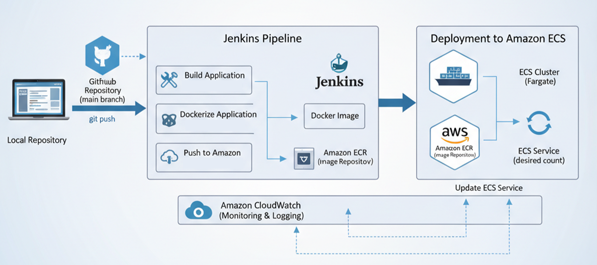

# DevOps Task - Jenkins → ECR → ECS (Fargate) CI/CD

## 1. Introduction

This project demonstrates a complete, automated CI/CD pipeline for a Node.js application, from code commit to deployment. The architecture leverages a combination of open-source and AWS services to provide a robust and scalable workflow. The pipeline automates the building of a Docker image, pushes it to a private container registry, and deploys it to a container orchestration service.

The primary tools and services used in this project are:
* **Source Control:** GitHub
* **CI/CD Orchestration:** Jenkins
* **Containerization:** Docker
* **Container Registry:** Amazon ECR
* **Container Orchestration:** Amazon ECS (Fargate)
* **Monitoring & Logging:** Amazon CloudWatch

## 2. Process and Workflow

The pipeline is defined in a `Jenkinsfile` and is triggered by a webhook from a GitHub repository.

1.  **Code Commit & Trigger:** A developer pushes code to the `main` branch of the GitHub repository, which sends a webhook notification to Jenkins.
2.  **Jenkins Pipeline Execution:**
    * **Checkout:** The pipeline checks out the latest code from the commit that triggered the build.
    * **Build & Tag:** The application is built, and a Docker image is created. This image is tagged with two identifiers: an immutable tag based on the Jenkins build number (`${BUILD_NUMBER}-${shortCommit}`) and a mutable `:latest` tag.
    * **Push to ECR:** The image is pushed to a designated Amazon ECR repository. The Jenkins agent is configured with an IAM role that has the necessary permissions to authenticate and push the image to ECR.
    * **Deploy to ECS:** The pipeline updates the ECS service by registering a new task definition with the new image URI. This action forces a new deployment, causing ECS to gracefully replace old tasks with new ones running the latest code.
3.  **Logging & Monitoring:** The ECS tasks are configured to use the `awslogs` driver, which streams container logs (`stdout` and `stderr`) to a dedicated CloudWatch Logs group (`/ecs/devops-task`). CloudWatch metrics for CPU and Memory utilization are also captured and visualized on a custom dashboard.

## 3. Challenges and Common Issues

* **`CannotPullContainerError`:** This is a frequent issue that typically points to one of two problems:
    * **Permissions:** The ECS Task Execution Role lacks the necessary IAM permissions to pull images from ECR.
    * **Image URI:** The image URI in the task definition is incorrect or the specified image does not exist in the ECR repository.
* **No Logs Appearing:** This occurs if the `awslogs` log driver is not correctly configured in the `taskdef.json`, or if the ECS Task Execution Role does not have the `AmazonECSTaskExecutionRolePolicy` attached, which grants permissions to write to CloudWatch Logs.
* **Webhook Not Triggering:** The Jenkins job may not be correctly configured to receive GitHub webhooks. Ensure the "GitHub hook trigger for GITScm polling" option is enabled in the job settings and the GitHub webhook URL is configured correctly with a trailing slash (`https://<JENKINS_HOST>/github-webhook/`).

## 4. Strategies Implemented

* **Infrastructure as Code (IaC) Principles:** While the AWS resources themselves are provisioned separately, the `taskdef.json` serves as a template, allowing the pipeline to automate the task definition registration. This approach provides consistency and repeatability.
* **Immutable Image Tags:** The pipeline pushes both a build-specific, immutable tag and a mutable `:latest` tag. This strategy ensures that rollbacks are reliable, as a specific, verified version of the image can always be referenced by its unique tag.
* **Rollback Mechanism:** The immutable nature of ECS task definition revisions allows for a simple and effective rollback strategy. By updating the service to an older task definition revision, a previous, stable version of the application can be quickly restored.
* **Principle of Least Privilege:** The IAM role used by the Jenkins EC2 instance is configured with the minimum required permissions to perform its tasks (i.e., pushing to ECR and updating ECS), thereby reducing the security risk.
* **Container Security:** The `Dockerfile` uses a multi-stage build to create a lightweight, minimal runtime image. This practice minimizes the attack surface by excluding unnecessary build tools and dependencies from the final image.

## 5. Future Scopes

Given more time and resources, this project could be enhanced in several key areas to improve its robustness, security, and developer experience:
* **Git Branching Strategy:** Implement a structured Git branching model (e.g., GitFlow or GitHub Flow). This would involve:
    * **`dev` branch:** For ongoing development and feature work. Commits to `dev` could trigger deployments to a development/testing environment.
    * **`main` branch:** Kept clean and stable, representing the current production-ready code. Merges into `main` would trigger deployments to a staging or production environment after thorough testing.
    * **`release` branches:** Created for specific release cycles, allowing for final bug fixes and testing before merging into `main` and deploying to production.
    _While not implemented in this demo due to time constraints, adopting such a strategy is crucial for managing concurrent development, ensuring code quality, and facilitating controlled releases in a team environment._

* **Infrastructure as Code (IaC) for AWS Resources:** Implement IaC tools like Terraform or AWS CloudFormation to manage all AWS resources (ECS Cluster, ECR Repository, IAM Roles, Security Groups, Load Balancers, CloudWatch Alarms/Dashboards) instead of manual provisioning. This ensures environments are consistent and reproducible.
* **Automated Testing:** Integrate more comprehensive automated testing into the Jenkins pipeline:
    * **Unit/Integration Tests:** Run `npm test` (or equivalent) in a dedicated stage.
    * **Static Code Analysis:** Tools like SonarQube or ESLint for code quality and security.
    * **Container Image Scanning:** Integrate tools like Clair or AWS ECR's built-in image scanning to detect vulnerabilities in Docker images before deployment.
* **Blue/Green or Canary Deployments:** Instead of a simple `force-new-deployment`, implement more advanced deployment strategies using AWS CodeDeploy or native ECS capabilities. This would allow for zero-downtime deployments and gradual traffic shifting, reducing the risk of new deployments.
* **Application Load Balancer (ALB) Integration:** For production readiness, deploy an ALB in front of the ECS service for features like:
    * **Load Balancing:** Distributing traffic across multiple tasks.
    * **HTTPS Termination:** Managing SSL certificates and secure communication.
    * **Path/Host-Based Routing:** Supporting multiple services behind a single load balancer.
    * **Target Group Health Checks:** Ensuring traffic is only routed to healthy instances.
* **Centralized Logging & Metrics Aggregation:** While CloudWatch is used, further enhancements could include:
    * **ELK Stack (Elasticsearch, Logstash, Kibana) or Grafana/Loki:** For more advanced log analysis, visualization, and custom dashboards.
    * **Custom Metrics:** Instrument the application code to emit custom metrics to CloudWatch or other monitoring systems.
* **Multi-Environment Deployment:** Extend the pipeline to support deployments across different environments (e.g., `dev`, `staging`, `production`), with appropriate manual approvals or gates for critical stages.
* **Notifications:** Configure more robust notifications (e.g., Slack, Email via SNS) for pipeline status, failed deployments, or critical alarms.
* **Cost Optimization:** Implement Fargate Spot capacity for non-critical workloads or investigate Graviton instances for potential cost savings and performance improvements.